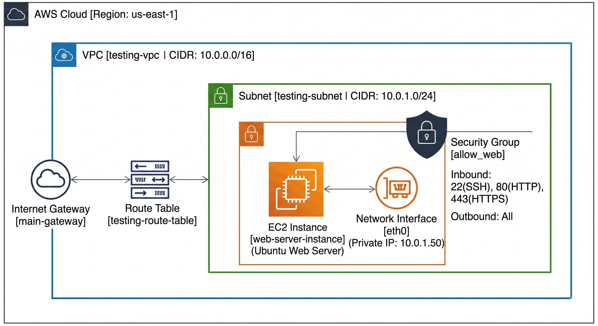

-----

# 🚀 AWS Infrastructure Automation with Terraform & LocalStack

## 📌 Project Overview

This repository contains a complete **Infrastructure as Code (IaC)** project using **Terraform**. The goal is to automate the deployment of a secure networking environment and a web server on AWS.

To ensure a cost-effective development cycle, the infrastructure is deployed locally using **LocalStack**, mimicking a real-world cloud environment without incurring AWS costs.

-----

## 🏗️ Architecture Diagram

-----

## 🛠️ Infrastructure Components & Logic

The project follows a step-by-step modular approach to build the cloud stack:

1.  **Networking Foundation (VPC):** Created a custom VPC (`10.0.0.0/16`) to isolate the environment.
2.  **Public Access:** Attached an **Internet Gateway** and configured a **Route Table** to allow traffic to the outside world (`0.0.0.0/0`).
3.  **Subnetting:** Defined a public subnet (`10.0.1.0/24`) within the VPC.
4.  **Security Layer:** Implemented a **Security Group** acting as a firewall to permit ports `22` (SSH), `80` (HTTP), and `443` (HTTPS).
5.  **Static Networking:** Provisioned a **Network Interface (ENI)** with a fixed private IP (`10.0.1.50`).
6.  **Compute Instance:** Deployed an **EC2 Ubuntu Server** and automated the installation of **Apache2** using `user_data` scripts.

-----

## 💻 Complete Terraform Code (`main.tf`)

Below is the full implementation with inline explanations:

```hcl
# Configuration for the AWS Provider
provider "aws" {
  region                      = "us-east-1"
  access_key                  = "mock_access_key"
  secret_key                  = "mock_secret_key"
  skip_credentials_validation = true
  skip_metadata_api_check     = true
  skip_requesting_account_id  = true

  # Redirecting API calls to LocalStack
  endpoints { 
    ec2 = "http://localhost:4566"
  }
}

# 1. Building the Virtual Private Cloud (The main network)
resource "aws_vpc" "testing-vpc" {
  cidr_block = "10.0.0.0/16"
  tags = {
    Name = "testing-vpc"
  }
}

# 2. Creating an Internet Gateway (The door to the internet)
resource "aws_internet_gateway" "main-gateway" {
  vpc_id = aws_vpc.testing-vpc.id
}

# 3. Setting up the Route Table (The GPS for network traffic)
resource "aws_route_table" "testing-route-table" {
  vpc_id = aws_vpc.testing-vpc.id

  route {
    cidr_block = "0.0.0.0/0"
    gateway_id = aws_internet_gateway.main-gateway.id
  }

  tags = {
    Name = "testing-route-table"
  }
}

# 4. Creating a Subnet (A smaller segment within the VPC)
resource "aws_subnet" "testing-subnet" {
  vpc_id            = aws_vpc.testing-vpc.id
  cidr_block        = "10.0.1.0/24"
  availability_zone = "us-east-1a"
  tags = {
    Name = "testing-subnet"
  }
}

# 5. Connecting the Subnet to the Route Table
resource "aws_route_table_association" "a" {
  subnet_id      = aws_subnet.testing-subnet.id
  route_table_id = aws_route_table.testing-route-table.id
}

# 6. Defining Firewall Rules (Security Group)
resource "aws_security_group" "allow_web" {
  name        = "allow_web_traffic"
  description = "Allow inbound traffic for Web and SSH"
  vpc_id      = aws_vpc.testing-vpc.id

  # HTTPS Access
  ingress {
    from_port   = 443
    to_port     = 443
    protocol    = "tcp"
    cidr_blocks = ["0.0.0.0/0"]
  }
  # HTTP Access
  ingress {
    from_port   = 80
    to_port     = 80
    protocol    = "tcp"
    cidr_blocks = ["0.0.0.0/0"]
  }
  # SSH Access
  ingress {
    from_port   = 22
    to_port     = 22
    protocol    = "tcp"
    cidr_blocks = ["0.0.0.0/0"]
  }
  # Allow all outbound traffic
  egress {
    from_port   = 0
    to_port     = 0
    protocol    = "-1"
    cidr_blocks = ["0.0.0.0/0"]
  }
}

# 7. Creating a specific Network Interface for the server
resource "aws_network_interface" "web-server-nic" {
  subnet_id       = aws_subnet.testing-subnet.id
  private_ips     = ["10.0.1.50"]
  security_groups = [aws_security_group.allow_web.id]
}

# 8. Launching the EC2 Instance (The Web Server)
resource "aws_instance" "web-server-instance" {
  ami               = "ami-085925f297f89fce1"
  instance_type     = "t2.micro"
  availability_zone = "us-east-1a"

  # Attaching the Network Interface
  network_interface {
    device_index         = 0
    network_interface_id = aws_network_interface.web-server-nic.id
  }

  # Shell script to install Apache and create a welcome page
  user_data = <<-EOF
              #!/bin/bash
              sudo apt update -y
              sudo apt install apache2 -y
              sudo systemctl start apache2
              sudo bash -c 'echo Your Very First Web Server > /var/www/html/index.html'
              EOF

  tags = {
    Name = "web-server"
  }
}
```

-----

## 🚀 Deployment Steps

1.  **Clone the Repo:** `git clone <repo-url>`
2.  **Start LocalStack:** Ensure Docker is running and start the LocalStack container.
3.  **Initialize Terraform:** `terraform init` to download necessary plugins.
4.  **Check Plan:** `terraform plan` to verify intended changes.
5.  **Deploy:** `terraform apply --auto-approve` to build the infrastructure.

-----

## 🛡️ Security Best Practices Implemented

  * **Isolation:** Infrastructure is deployed in a custom VPC, avoiding the default AWS setup.
  * **Static Internal Networking:** Used ENIs for predictable internal communication.
  * **Automation:** Used `user_data` to ensure consistent server configuration and eliminate manual errors.

-----

## 👨‍💻 Author

**Mahmoud Walid**
*DevOps & Cloud Engineering Student*

-----